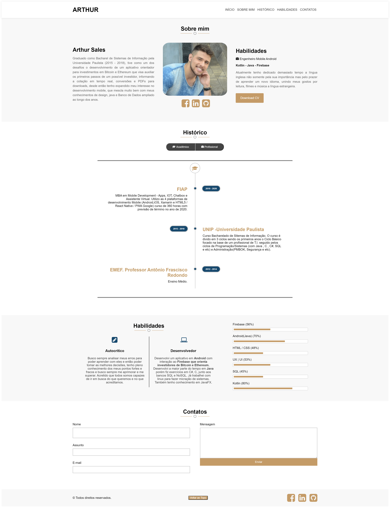

# Site 

## Neste trabalho foi desenvolvido um portfólio (conforme print abaixo). Na seguinte estrutura:

- Header;
- Topo contendo Foto + Descrição'
- Módulo com abas de escolaridade e histórico profissional;
- Habilidades separadas por barra de progresso;
- Formulário;
- Footer;

## PONTOS IMPORTANTES:

- Usado CSS puro;
- Usado JS puro;
- O projeto está na branch master no Github;
- Código padronizado com CSS, JS e HTML;

